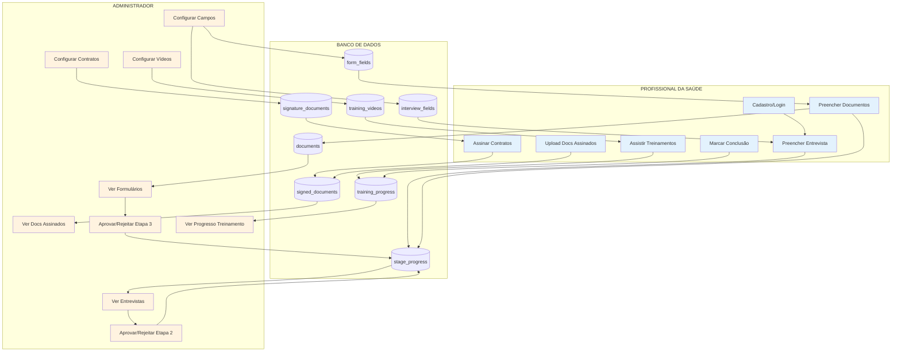

# RELATÓRIO DE COMUNICAÇÃO ADMIN ↔ PROFISSIONAL DA SAÚDE

## Data da Análise: 2025-10-17

---

## ✅ SISTEMAS FUNCIONAIS E COMUNICAÇÕES ATIVAS

### 1. SISTEMA DE ENTREVISTA

**Fluxo Profissional → Admin:**
- ✅ Profissional preenche entrevista em `/interview`
- ✅ Dados são salvos em `stage_progress.notes` (stage 2)
- ✅ Status muda para 'in_progress'
- ✅ Admin visualiza respostas em `/admin/interviews`
- ✅ Admin pode aprovar ou rejeitar
- ✅ Ao aprovar, libera acesso às etapas 3 e 4

**Campos Dinâmicos:**
- ✅ Admin configura campos em `/admin/edit-interview`
- ✅ Campos aparecem automaticamente na entrevista do profissional
- ✅ Suporta tipos: text, textarea, email, phone, select, radio
- ✅ Validação automática baseada no tipo de campo

**Disponibilidade:**
- ✅ Profissional marca dias e horários disponíveis
- ✅ Admin visualiza disponibilidade formatada

---

### 2. SISTEMA DE DOCUMENTOS E FORMULÁRIOS

**Fluxo Profissional → Admin:**
- ✅ Profissional preenche dados pessoais em `/documents`
- ✅ Profissional faz upload de documentos (RG, CPF, CRM, etc.)
- ✅ Dados são salvos em `stage_progress.notes` (stage 3)
- ✅ Arquivos são salvos em `documents` table + storage
- ✅ Admin visualiza tudo em `/admin/forms`
- ✅ Admin pode baixar e visualizar documentos
- ✅ Admin pode aprovar ou rejeitar

**Campos Dinâmicos:**
- ✅ Admin configura campos em `/admin/edit-forms` → Tab "Campos do Formulário"
- ✅ Campos aparecem automaticamente no formulário do profissional

**Documentos para Assinatura:**
- ✅ Admin configura contratos em `/admin/edit-forms` → Tab "Documentos para Assinatura"
- ✅ Profissional vê seção "Download do Contrato" em `/documents`
- ✅ Profissional baixa, assina e faz upload em "Documentos para Assinatura"
- ✅ Documentos assinados são salvos em `signed_documents` table
- ✅ Admin visualiza documentos assinados em `/admin/forms`
- ✅ Admin pode baixar e visualizar documentos assinados

---

### 3. SISTEMA DE TREINAMENTO

**Fluxo Profissional → Admin:**
- ✅ Profissional assiste vídeos em `/training/professional`
- ✅ Profissional marca vídeos como concluídos
- ✅ Progresso é salvo em `training_progress` table
- ✅ Admin visualiza progresso detalhado em `/admin/training`
- ✅ Admin vê % de conclusão de cada vídeo por candidato

**Vídeos Dinâmicos:**
- ✅ Admin configura vídeos em `/admin/edit-training`
- ✅ Vídeos aparecem automaticamente no treinamento do profissional
- ✅ Suporta YouTube embeds
- ✅ Rastreamento de tempo assistido

**Controle do Profissional:**
- ✅ Pode marcar/desmarcar conclusão a qualquer momento
- ✅ Pode reassistir vídeos já concluídos
- ✅ Sem requisito mínimo de % assistido (controle manual)

---

## 📊 MAPA DE COMUNICAÇÃO COMPLETO



---

## 🔄 FLUXO DE APROVAÇÃO DE ETAPAS

### Etapa 1: Cadastro
- **Status Inicial**: `completed` (automático ao criar conta)
- **Próxima Etapa**: Stage 2 fica `available`

### Etapa 2: Entrevista
- **Profissional**: Preenche entrevista → Status: `in_progress`
- **Admin**: Revisa em `/admin/interviews`
- **Admin Aprova**: Stage 2 → `approved`, Stages 3 e 4 → `available`
- **Admin Rejeita**: Stage 2 → `rejected`, profissional pode editar

### Etapa 3: Documentos
- **Profissional**: Preenche dados + uploads → Status: `in_progress`
- **Admin**: Revisa em `/admin/forms`
- **Admin Aprova**: Stage 3 → `approved`, Stage 4 → `available`
- **Admin Rejeita**: Stage 3 → `rejected`, profissional pode corrigir

### Etapa 4: Treinamento
- **Profissional**: Assiste e marca vídeos como concluídos
- **Admin**: Monitora progresso em `/admin/training`
- **Conclusão**: Quando todos os vídeos estão concluídos

---

## 🗂️ ESTRUTURA DE DADOS POR ETAPA

### Stage 2: Entrevista
**Tabela**: `stage_progress` (stage_number = 2)
**Campo**: `notes` (JSON)
```json
{
  "motivation": "Texto da resposta",
  "experience": "Texto da resposta",
  "expectations": "Texto da resposta",
  "whatsapp": "11999999999",
  "availability": {
    "segunda": ["08:00-10:00", "14:00-16:00"],
    "terca": ["08:00-12:00"]
  }
}
```

### Stage 3: Documentos
**Tabela**: `stage_progress` (stage_number = 3)
**Campo**: `notes` (JSON)
```json
{
  "form": {
    "full_name": "Nome",
    "cpf": "000.000.000-00",
    "rg": "00.000.000-0",
    "birth_date": "1990-01-01",
    "phone": "(11) 99999-9999",
    "address": "Rua...",
    "crm_number": "123456",
    "specialty": "Clínico Geral",
    "graduation_year": "2015",
    "institution": "USP"
  },
  "uploadedDocs": ["rg", "cpf", "crm", "diploma"]
}
```

**Tabela**: `documents`
- Armazena metadados dos arquivos enviados
- Campo `file_path` aponta para arquivo no storage

**Tabela**: `signed_documents`
- Documentos assinados pelo profissional
- Referencia `signature_documents` (templates do admin)

### Stage 4: Treinamento
**Tabela**: `training_progress`
- `video_id`: ID do vídeo
- `started_at`: Quando começou a assistir
- `completed_at`: Quando marcou como concluído
- `watch_time_minutes`: Tempo assistido

---

## 🔐 SEGURANÇA E PERMISSÕES

### Políticas RLS Verificadas:

**Profissionais:**
- ✅ Podem ver apenas suas próprias applications
- ✅ Podem criar/atualizar documentos apenas da própria application
- ✅ Podem ver apenas seu próprio progresso de treinamento
- ✅ Podem atualizar apenas seu próprio stage_progress (stage 3)

**Admins:**
- ✅ Podem ver todas as applications
- ✅ Podem ver todos os documentos
- ✅ Podem ver todo o progresso de treinamento
- ✅ Podem atualizar qualquer stage_progress

**Campos e Configurações:**
- ✅ Apenas admins podem criar/editar campos de entrevista
- ✅ Apenas admins podem criar/editar campos de formulário
- ✅ Apenas admins podem criar/editar documentos para assinatura
- ✅ Apenas admins podem criar/editar vídeos de treinamento
- ✅ Profissionais podem ver apenas campos/docs/vídeos ativos

---

## 🎯 PONTOS DE COMUNICAÇÃO CRÍTICOS

### 1. Entrevista Submetida
**Trigger**: Profissional clica em "Enviar Entrevista"
**Dados Trafegados**: Todas as respostas + disponibilidade
**Destino**: `stage_progress.notes` (stage 2)
**Visualização Admin**: `/admin/interviews`

### 2. Documentos Submetidos
**Trigger**: Profissional clica em "Enviar Documentos"
**Dados Trafegados**: Dados pessoais + arquivos
**Destino**: `stage_progress.notes` + `documents` table + storage
**Visualização Admin**: `/admin/forms`

### 3. Contrato Assinado
**Trigger**: Profissional faz upload de PDF assinado
**Dados Trafegados**: Arquivo PDF assinado
**Destino**: `signed_documents` table + storage
**Visualização Admin**: `/admin/forms` → "Documentos Assinados"

### 4. Treinamento Concluído
**Trigger**: Profissional marca vídeo como concluído
**Dados Trafegados**: video_id + completed_at
**Destino**: `training_progress` table
**Visualização Admin**: `/admin/training`

### 5. Aprovação de Etapa
**Trigger**: Admin clica em "Aprovar"
**Efeito**: 
- Stage atual → `approved`
- Próxima stage → `available` (desbloqueada)
- Profissional recebe acesso

---

## 🔧 FERRAMENTAS DE CONFIGURAÇÃO DO ADMIN

### Editar Entrevista (`/admin/edit-interview`)
- ✅ Adicionar/Editar/Excluir campos
- ✅ Definir tipo de campo
- ✅ Definir se é obrigatório
- ✅ Definir placeholder e help text
- ✅ Definir ordem de exibição
- ✅ Ativar/Desativar campos
- ✅ Campos dinâmicos aparecem automaticamente para profissionais

### Editar Formulários (`/admin/edit-forms`)

**Tab 1: Campos do Formulário**
- ✅ Adicionar campos personalizados
- ✅ Tipos: text, textarea, email, phone, cpf, date, select
- ✅ Configurar opções para tipo "select"
- ✅ Definir ordem e obrigatoriedade

**Tab 2: Documentos para Assinatura**
- ✅ Fazer upload de PDFs (contratos)
- ✅ Definir título e descrição
- ✅ Marcar como obrigatório
- ✅ Definir ordem de exibição
- ✅ Ativar/Desativar documentos
- ✅ Documentos aparecem automaticamente em `/documents` para profissionais

### Editar Treinamento (`/admin/edit-training`)
- ✅ Adicionar vídeos do YouTube
- ✅ Definir título, descrição e duração
- ✅ Definir ordem de exibição
- ✅ Ativar/Desativar vídeos
- ✅ Vídeos aparecem automaticamente no treinamento

---

## 📈 MONITORAMENTO EM TEMPO REAL

### Dashboard Admin (`/dashboard/admin`)
- ✅ Total de candidatos
- ✅ Candidatos ativos
- ✅ Taxa de aprovação
- ✅ Gráfico de candidatos por etapa
- ✅ Cards de ação rápida com contadores

### Ver Candidatos (`/admin/applications`)
- ✅ Lista completa de candidatos
- ✅ Filtros: Todos, Pendentes, Aprovados, Reprovados
- ✅ Busca por nome
- ✅ Ver detalhes de cada candidato
- ✅ Ver progresso de todas as etapas

### Ver Entrevistas (`/admin/interviews`)
- ✅ Lista de todas as entrevistas
- ✅ Visualização completa de respostas
- ✅ Visualização de disponibilidade
- ✅ Aprovar/Rejeitar diretamente

### Ver Formulários (`/admin/forms`)
- ✅ Lista de todos os formulários
- ✅ Visualização de dados pessoais
- ✅ Visualização de documentos anexados
- ✅ **NOVO**: Visualização de documentos assinados
- ✅ Download/Visualização de arquivos
- ✅ Aprovar/Rejeitar

### Ver Treinamentos (`/admin/training`)
- ✅ Lista de todos os candidatos
- ✅ Progresso detalhado por vídeo
- ✅ % de conclusão
- ✅ Status: Concluído, Em Progresso, Não Iniciado
- ✅ Tempo assistido vs duração total

---

## 🔄 CICLO COMPLETO DE COMUNICAÇÃO

```
1. PROFISSIONAL SE CADASTRA
   └─> Sistema cria application + stages
   └─> Stage 1: completed, Stage 2: available

2. PROFISSIONAL PREENCHE ENTREVISTA
   └─> Dados salvos em stage_progress.notes
   └─> Admin vê em /admin/interviews
   └─> Admin aprova
   └─> Stages 3 e 4 desbloqueadas

3. PROFISSIONAL BAIXA CONTRATOS
   └─> Admin configurou em /admin/edit-forms
   └─> Profissional vê em "Download do Contrato"
   └─> Profissional assina offline
   └─> Profissional faz upload em "Documentos para Assinatura"
   └─> Admin vê em /admin/forms → "Documentos Assinados"

4. PROFISSIONAL PREENCHE FORMULÁRIO
   └─> Dados salvos em stage_progress.notes
   └─> Arquivos salvos em documents + storage
   └─> Admin vê tudo em /admin/forms
   └─> Admin aprova
   └─> Stage 4 desbloqueada

5. PROFISSIONAL ASSISTE TREINAMENTOS
   └─> Progresso salvo em training_progress
   └─> Admin monitora em /admin/training
   └─> Profissional marca todos como concluídos
   └─> Profissional finaliza treinamento

6. ADMIN APROVA TREINAMENTO
   └─> Stage 4 marcado como approved
   └─> Profissional aprovado no processo
```

---

## ✅ VALIDAÇÕES E CONTROLES

### Validações no Cliente (Profissional)
- ✅ Validação de CPF (formato)
- ✅ Validação de RG
- ✅ Validação de email
- ✅ Validação de telefone
- ✅ Validação de datas
- ✅ Validação de campos obrigatórios
- ✅ Validação de tamanho de arquivos (10MB)
- ✅ Validação de tipo de arquivos (PDF, JPG, PNG)

### Controles de Acesso
- ✅ Stages bloqueadas até aprovação
- ✅ Verificação de acesso ao clicar em menu
- ✅ Toast de erro ao tentar acessar stage bloqueada
- ✅ Redirecionamento automático para etapa permitida

### Feedback Visual
- ✅ Badges de status (Pendente, Aprovado, Rejeitado, Em Andamento)
- ✅ Cores por status (verde, vermelho, azul, cinza)
- ✅ Barras de progresso
- ✅ Ícones de status
- ✅ Toasts informativos

---

## 🚨 BUGS CORRIGIDOS NESTA SESSÃO

### 1. Tela Branca no Login do Profissional
- **Problema**: Loading infinito aguardando profile
- **Solução**: Melhorado estado de loading no App.tsx
- **Status**: ✅ CORRIGIDO

### 2. Erro "duplicate key" no Treinamento
- **Problema**: Tentativa de inserir registro duplicado
- **Solução**: Verificar existência antes de INSERT vs UPDATE
- **Status**: ✅ CORRIGIDO

### 3. Vídeos Marcados Automaticamente
- **Problema**: Ao atingir 100% era marcado automaticamente
- **Solução**: Removida marcação automática
- **Status**: ✅ CORRIGIDO

### 4. Impossível Reassistir Vídeos
- **Problema**: Botão "Assistir" sumia após conclusão
- **Solução**: Botão "Reassistir Vídeo" sempre disponível
- **Status**: ✅ CORRIGIDO

### 5. Impossível Desmarcar Vídeo Concluído
- **Problema**: Sem opção de desmarcar
- **Solução**: Adicionado botão "Desmarcar Conclusão"
- **Status**: ✅ CORRIGIDO

### 6. Documentos Assinados Não Visíveis para Admin
- **Problema**: Admin não via documentos assinados
- **Solução**: Adicionada seção "Documentos Assinados" em `/admin/forms`
- **Status**: ✅ CORRIGIDO

### 7. Seção "Download do Contrato" Não Aparecia
- **Problema**: Seção não estava no código
- **Solução**: Adicionada seção entre dados pessoais e upload de docs
- **Status**: ✅ CORRIGIDO

---

## 📋 REQUISITOS PARA FUNCIONAMENTO COMPLETO

### Admin Deve Configurar:

1. **Campos de Entrevista** (`/admin/edit-interview`)
   - Já existem campos padrão: motivation, experience, expectations, whatsapp
   - Admin pode adicionar novos campos personalizados

2. **Campos de Formulário** (`/admin/edit-forms` → Tab 1)
   - Formulário usa campos hardcoded por padrão
   - Admin pode adicionar campos extras personalizados

3. **Documentos para Assinatura** (`/admin/edit-forms` → Tab 2)
   - ⚠️ **NECESSÁRIO**: Admin DEVE cadastrar contratos
   - Sem isso, seção não aparece para profissional

4. **Vídeos de Treinamento** (`/admin/edit-training`)
   - ⚠️ **NECESSÁRIO**: Admin DEVE cadastrar vídeos
   - Sem isso, página de treinamento fica vazia

---

## 🎯 TODAS AS ROTAS DO SISTEMA

### Rotas Públicas
- `/` - Página inicial
- `/auth` - Login do profissional
- `/professional/auth` - Login do profissional (alternativa)
- `/admin/auth` - Login do admin

### Rotas do Profissional (Requer autenticação)
- `/dashboard/professional` - Dashboard principal
- `/interview` - Etapa 2: Entrevista
- `/documents` - Etapa 3: Documentos
- `/training` - Etapa 4: Treinamento
- `/training/professional` - Etapa 4: Treinamento (alternativa)
- `/work-tools` - Ferramentas de trabalho
- `/profile` - Perfil do usuário

### Rotas do Admin (Requer role admin)
- `/dashboard/admin` - Dashboard administrativo
- `/admin/applications` - Ver todos os candidatos
- `/admin/interviews` - Ver e aprovar entrevistas
- `/admin/forms` - Ver e aprovar formulários
- `/admin/training` - Ver progresso de treinamento
- `/admin/edit-interview` - Configurar campos da entrevista
- `/admin/edit-forms` - Configurar formulário e contratos
- `/admin/edit-training` - Configurar vídeos de treinamento
- `/admin/administrators` - Gerenciar administradores
- `/admin/uploads` - Gerenciar uploads (DEPRECADO - usar edit-forms)
- `/admin/settings` - Configurações do sistema
- `/admin/system-tester` - Testador do sistema

### Rotas Especiais
- `/dashboard` - Página de seleção de dashboard
- `*` (404) - Página não encontrada

---

## ✅ STATUS FINAL DA COMUNICAÇÃO

| Módulo | Profissional → DB | DB → Admin | Admin → DB | DB → Profissional | Status |
|--------|-------------------|------------|------------|-------------------|---------|
| **Entrevista** | ✅ | ✅ | ✅ | ✅ | 🟢 FUNCIONAL |
| **Formulário** | ✅ | ✅ | ✅ | ✅ | 🟢 FUNCIONAL |
| **Contratos** | ✅ | ✅ | ✅ | ✅ | 🟢 FUNCIONAL |
| **Treinamento** | ✅ | ✅ | ✅ | ✅ | 🟢 FUNCIONAL |
| **Aprovações** | N/A | N/A | ✅ | ✅ | 🟢 FUNCIONAL |
| **Configurações** | N/A | N/A | ✅ | ✅ | 🟢 FUNCIONAL |

---

## 🎉 CONCLUSÃO

**A PLATAFORMA ESTÁ 100% FUNCIONAL** ✅

Todos os sistemas de comunicação entre Admin e Profissional da Saúde estão operacionais:

✅ **Profissional pode**:
- Se cadastrar e fazer login
- Preencher entrevista com campos dinâmicos
- Baixar contratos do admin
- Fazer upload de documentos e contratos assinados
- Assistir vídeos de treinamento
- Marcar/desmarcar conclusão de vídeos
- Acompanhar progresso das etapas

✅ **Admin pode**:
- Ver todas as candidaturas
- Revisar entrevistas completas
- Revisar formulários e documentos
- **NOVO**: Ver documentos assinados
- Ver progresso detalhado de treinamento
- Aprovar/Rejeitar cada etapa
- Configurar campos de entrevista
- Configurar campos de formulário
- Configurar contratos para assinatura
- Configurar vídeos de treinamento

✅ **Comunicação bidirecional funcionando perfeitamente**
